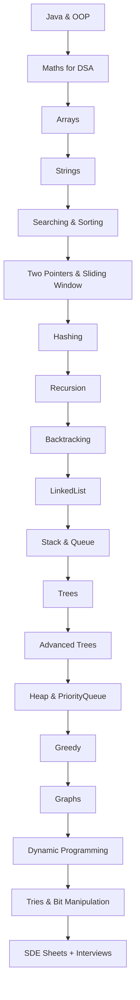

# 🚀 Java DSA Mastery — FAANG Preparation

<div align="center">
  
  
  
  
</div>

---

# 🔥 Why this repository?

### ✔️ Structured DSA learning path

### ✔️ Company-wise questions (Amazon, Google, Meta…)

### ✔️ SDE Sheets (TUF, CodeHelp, Apna College)

### ✔️ Topic-wise notes + patterns

### ✔️ Clean folder READMEs (templates included)

### ✔️ Eye-catchy design for GitHub visitors

---

# 📂 Folder Structure (Aesthetic + Emoji-Friendly)

```
📦 Java-DSA-Mastery
├── 🔢 Arrays/
├── 🧵 Strings/
├── 🔁 Two Pointer & Sliding Window/
├── 🔍 Binary Search/
├── 🔀 Sorting/
├── 🔧 Bit Manipulation/
├── 📚 Collection Framework/
├── ➗ Maths For DSA/
├── ♻️ Recursion/
├── 🧠 Recursion-Advanced/           
├── 🔙 Backtracking/
├── 🔗 Linked List/
├── 🧰 Stack/
├── 🛤 Queue/
├── 🌲 Trees/
├── 🌳 Trees-Advanced/               
├── 🔡 Tries/
├── 🔼 Heap & Priority Queue/        
├── ♟️ Greedy/
├── 🧭 Graph/
├── ⛓️ Hashing/
├── 🧩 Dynamic Programming/
├── 📝 SDE-Sheet/
│   ├── Apna College/
│   ├── CodeHelp/
│   └── Take U Forward/
├── 🧪 Interview/
│   ├── Amazon/
│   ├── Microsoft/
│   ├── Google/
│   ├── Meta-Facebook/
│   ├── Netflix/
│   ├── Uber/
│   ├── Adobe/
│   ├── LinkedIn/
│   ├── Oracle/
│   ├── Salesforce/
│   ├── Atlassian/
│   ├── Accenture/
│   ├── Postman/
│   └── Figma/
```
---


### 🔵 Core Topics


### 🟣 Data Structures


### 🟠 Algorithms


### 🟤 Java Essentials


### 🔥 Interview Preparation


---


# 🧭 DSA Roadmap (Mermaid Diagram — GitHub Supports It)



---

# 📐 Coding Standards (Short, Sharp, Professional)

* Class names → **PascalCase**
* Methods & variables → **camelCase**
* Only 1 problem per file
* Add **Time & Space Complexity** at the top
* No boilerplate spam (clean code > competitive template)
* Use meaningful variable names: `left`, `right`, `freq`, `visited`, etc.

---
# 📜 License

Licensed under **Apache 2.0**.

---
